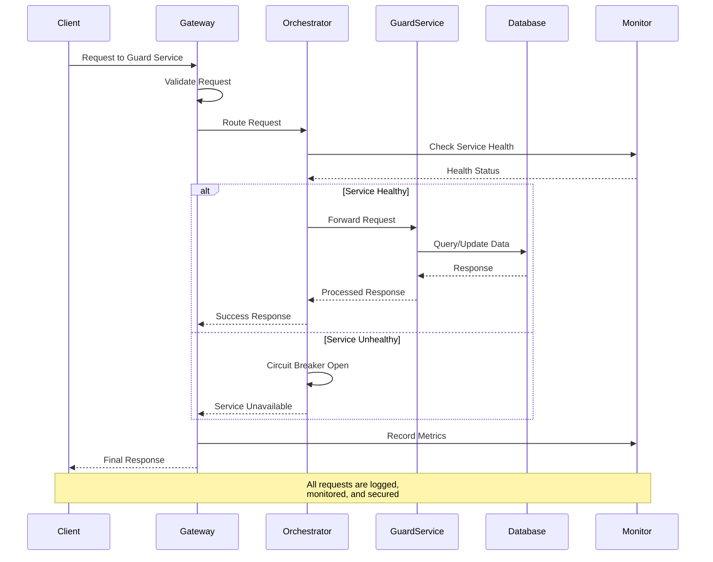
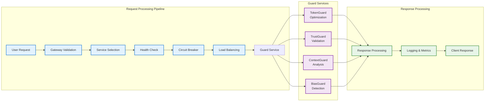
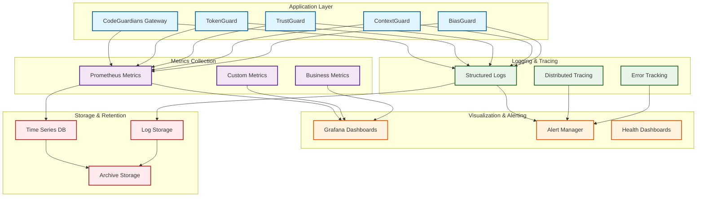
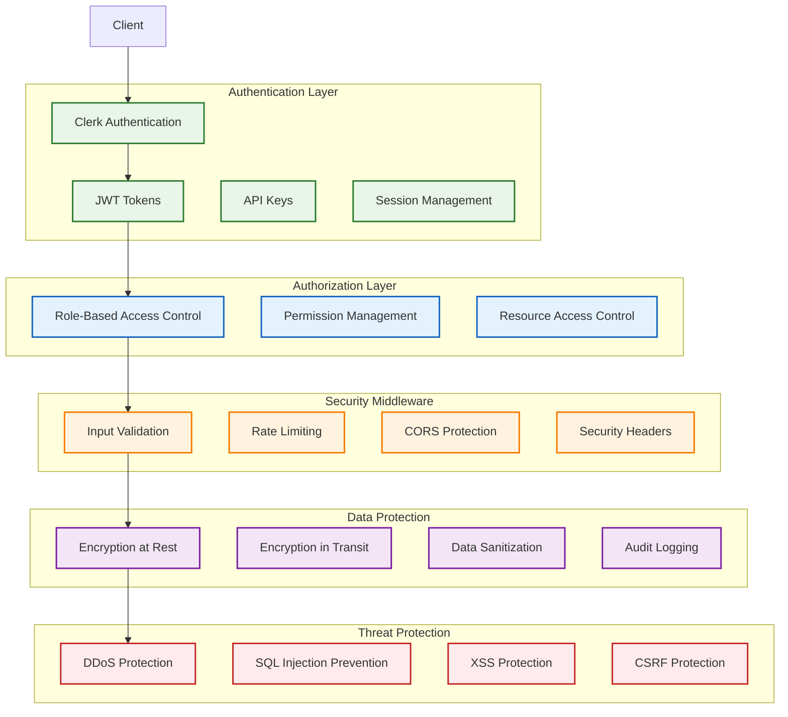
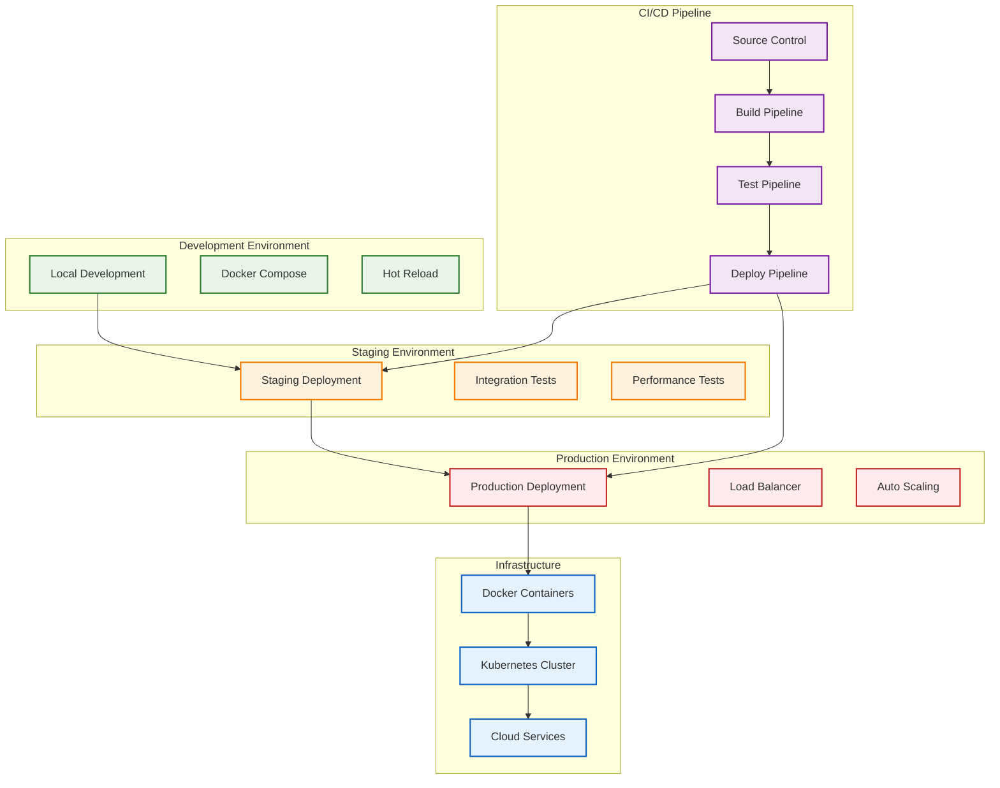

# CodeGuardians Ecosystem - System Architecture

## 🏗️ High-Level Architecture Overview

```mermaid
graph TB
    subgraph "External Dependencies (Optional)"
        AISuite[AI Agent Suite]
        TemplateHeaven[Template Heaven]
    end
    
    subgraph "CodeGuardians Gateway"
        Gateway[CodeGuardians Gateway<br/>Port 8000]
        Orchestrator[Guard Orchestrator]
        API[Unified API Gateway]
        Health[Health Monitor]
        Circuit[Circuit Breaker]
    end
    
    subgraph "Guard Services Layer"
        TokenGuard[TokenGuard<br/>Port 8001<br/>Token Optimization]
        TrustGuard[TrustGuard<br/>Port 8002<br/>AI Reliability]
        ContextGuard[ContextGuard<br/>Port 8003<br/>Context Management]
        BiasGuard[BiasGuard Backend<br/>Port 8004<br/>Bias Detection]
    end
    
    subgraph "Integration Layer"
        REST[REST API]
        WebSocket[WebSocket]
        MCP[MCP Server]
        LSP[LSP Server]
        Webhook[Webhook Handler]
    end
    
    subgraph "Data & Storage Layer"
        Database[(Neon Database)]
        Cache[(Redis Cache)]
        Memory[Memory Bank]
        Files[File Storage]
        Logs[Log Storage]
    end
    
    subgraph "Security & Auth Layer"
        Auth[Clerk Auth]
        Encryption[Encryption]
        Validation[Input Validation]
        Audit[Audit Logging]
        RateLimit[Rate Limiting]
    end
    
    subgraph "Monitoring & Observability"
        Prometheus[Prometheus]
        Grafana[Grafana]
        Metrics[Metrics]
        Tracing[Distributed Tracing]
        Alerts[Alert Manager]
    end
    
    subgraph "Infrastructure Layer"
        Docker[Docker Containers]
        K8s[Kubernetes]
        LoadBalancer[Load Balancer]
        CDN[CDN]
        Backup[Backup System]
    end
    
    %% External connections
    AISuite -.-> Gateway
    TemplateHeaven -.-> Gateway
    
    %% Gateway connections
    Gateway --> Orchestrator
    Gateway --> API
    Gateway --> Health
    Gateway --> Circuit
    
    %% Service connections
    Orchestrator --> TokenGuard
    Orchestrator --> TrustGuard
    Orchestrator --> ContextGuard
    Orchestrator --> BiasGuard
    
    %% Integration connections
    API --> REST
    API --> WebSocket
    API --> MCP
    API --> LSP
    API --> Webhook
    
    %% Data connections
    TokenGuard --> Database
    TrustGuard --> Database
    ContextGuard --> Memory
    BiasGuard --> Database
    
    %% Security connections
    Gateway --> Auth
    Gateway --> Encryption
    Gateway --> Validation
    Gateway --> Audit
    Gateway --> RateLimit
    
    %% Monitoring connections
    Gateway --> Prometheus
    Prometheus --> Grafana
    Gateway --> Metrics
    Gateway --> Tracing
    Prometheus --> Alerts
    
    %% Infrastructure connections
    Gateway --> Docker
    Docker --> K8s
    K8s --> LoadBalancer
    LoadBalancer --> CDN
    Database --> Backup
    
    %% Styling
    classDef gateway fill:#e1f5fe,stroke:#01579b,stroke-width:3px
    classDef guard fill:#f3e5f5,stroke:#4a148c,stroke-width:2px
    classDef integration fill:#e8f5e8,stroke:#1b5e20,stroke-width:2px
    classDef data fill:#fff3e0,stroke:#e65100,stroke-width:2px
    classDef security fill:#ffebee,stroke:#b71c1c,stroke-width:2px
    classDef monitoring fill:#f1f8e9,stroke:#33691e,stroke-width:2px
    classDef infrastructure fill:#e3f2fd,stroke:#0d47a1,stroke-width:2px
    classDef external fill:#fafafa,stroke:#424242,stroke-width:1px,stroke-dasharray: 5 5
    
    class Gateway,Orchestrator,API,Health,Circuit gateway
    class TokenGuard,TrustGuard,ContextGuard,BiasGuard guard
    class REST,WebSocket,MCP,LSP,Webhook integration
    class Database,Cache,Memory,Files,Logs data
    class Auth,Encryption,Validation,Audit,RateLimit security
    class Prometheus,Grafana,Metrics,Tracing,Alerts monitoring
    class Docker,K8s,LoadBalancer,CDN,Backup infrastructure
    class AISuite,TemplateHeaven external
```

## 🔄 Data Flow Architecture

## 🛡️ Guard Services Integration Flow

## 🔧 Service Communication Patterns

```mermaid
graph TB
    subgraph "Synchronous Communication"
        Sync1[HTTP REST API]
        Sync2[Request-Response]
        Sync3[Health Checks]
    end
    
    subgraph "Asynchronous Communication"
        Async1[WebSocket]
        Async2[Event Streaming]
        Async3[Webhooks]
    end
    
    subgraph "Protocol Integration"
        Protocol1[MCP Server]
        Protocol2[LSP Server]
        Protocol3[gRPC]
    end
    
    subgraph "Data Exchange"
        Data1[JSON Payloads]
        Data2[Binary Data]
        Data3[Streaming Data]
    end
    
    Gateway --> Sync1
    Gateway --> Async1
    Gateway --> Protocol1
    Gateway --> Data1
    
    classDef sync fill:#e8f5e8,stroke:#2e7d32,stroke-width:2px
    classDef async fill:#fff3e0,stroke:#f57c00,stroke-width:2px
    classDef protocol fill:#e3f2fd,stroke:#1565c0,stroke-width:2px
    classDef data fill:#f3e5f5,stroke:#7b1fa2,stroke-width:2px
    
    class Sync1,Sync2,Sync3 sync
    class Async1,Async2,Async3 async
    class Protocol1,Protocol2,Protocol3 protocol
    class Data1,Data2,Data3 data
```

## 📊 Monitoring & Observability Architecture

## 🔐 Security Architecture

## 🚀 Deployment Architecture

## 📋 Architecture Principles

### **1. Modularity**
- Each guard service is independently deployable
- Clear separation of concerns between components
- Loose coupling between services

### **2. Scalability**
- Horizontal scaling capabilities
- Load balancing and auto-scaling
- Stateless service design

### **3. Reliability**
- Circuit breaker pattern implementation
- Health monitoring and self-healing
- Graceful degradation

### **4. Security**
- Defense in depth security model
- End-to-end encryption
- Comprehensive audit logging

### **5. Observability**
- Comprehensive monitoring and metrics
- Distributed tracing
- Real-time alerting

### **6. Maintainability**
- Clean code architecture
- Comprehensive documentation
- Automated testing and deployment
