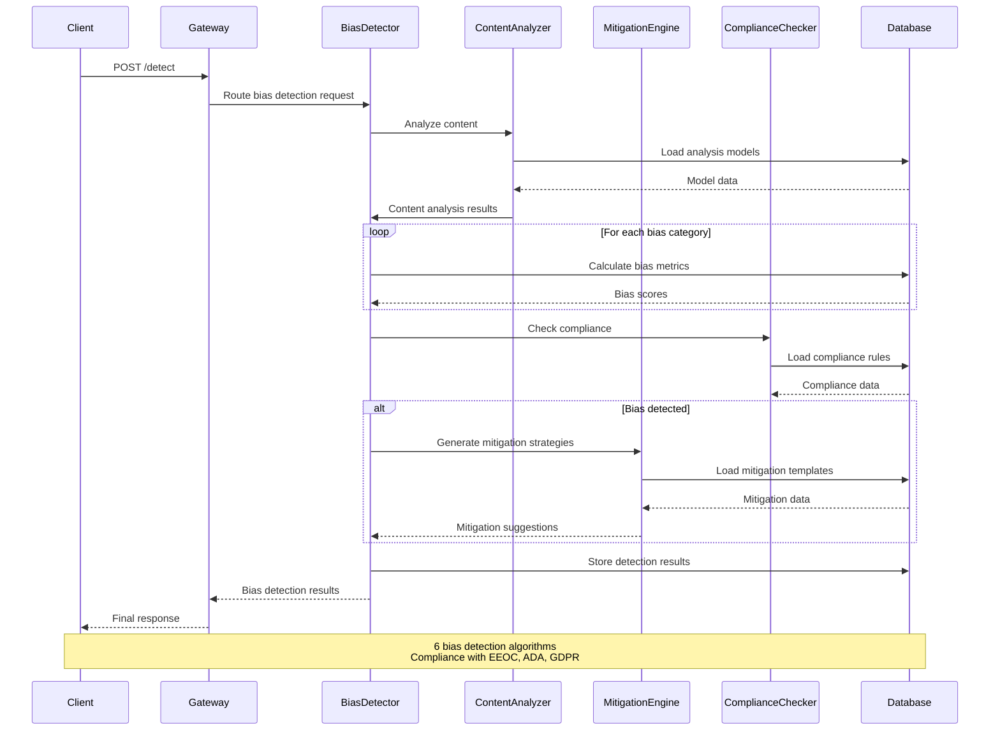
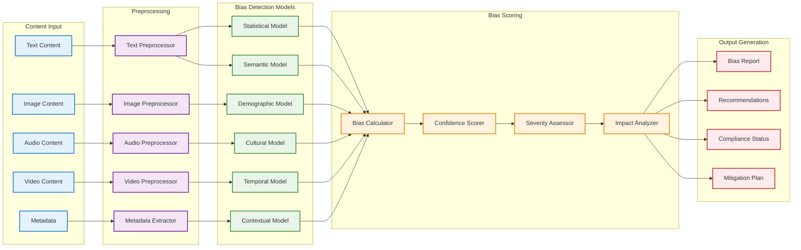
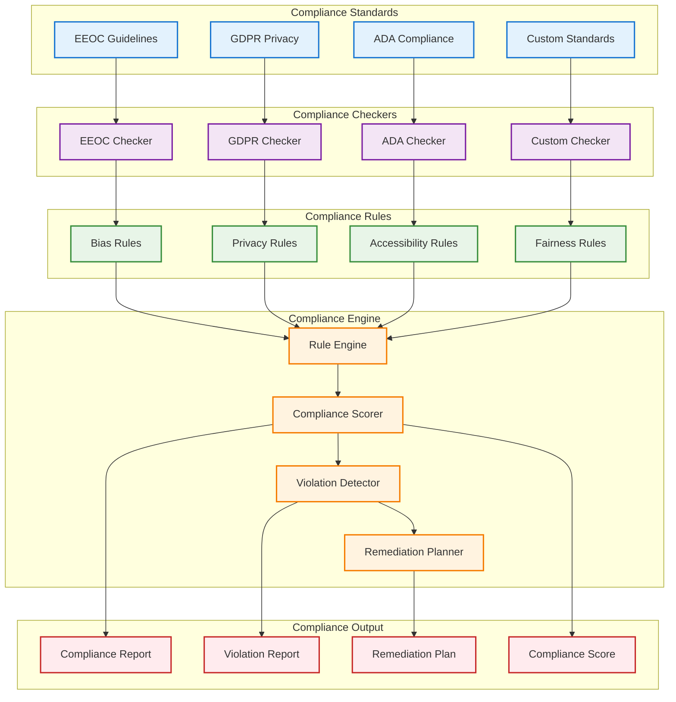
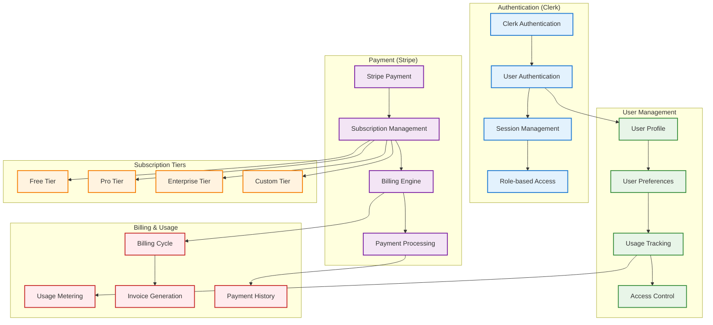
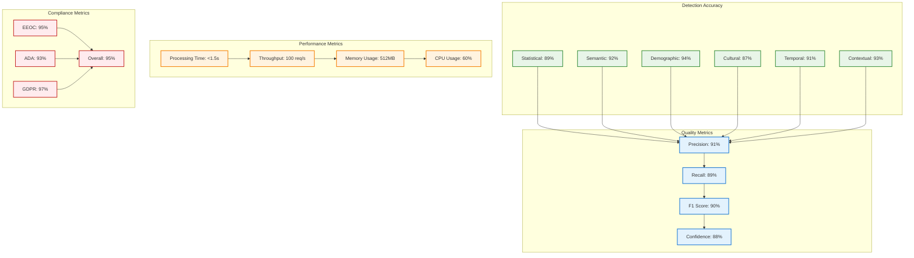
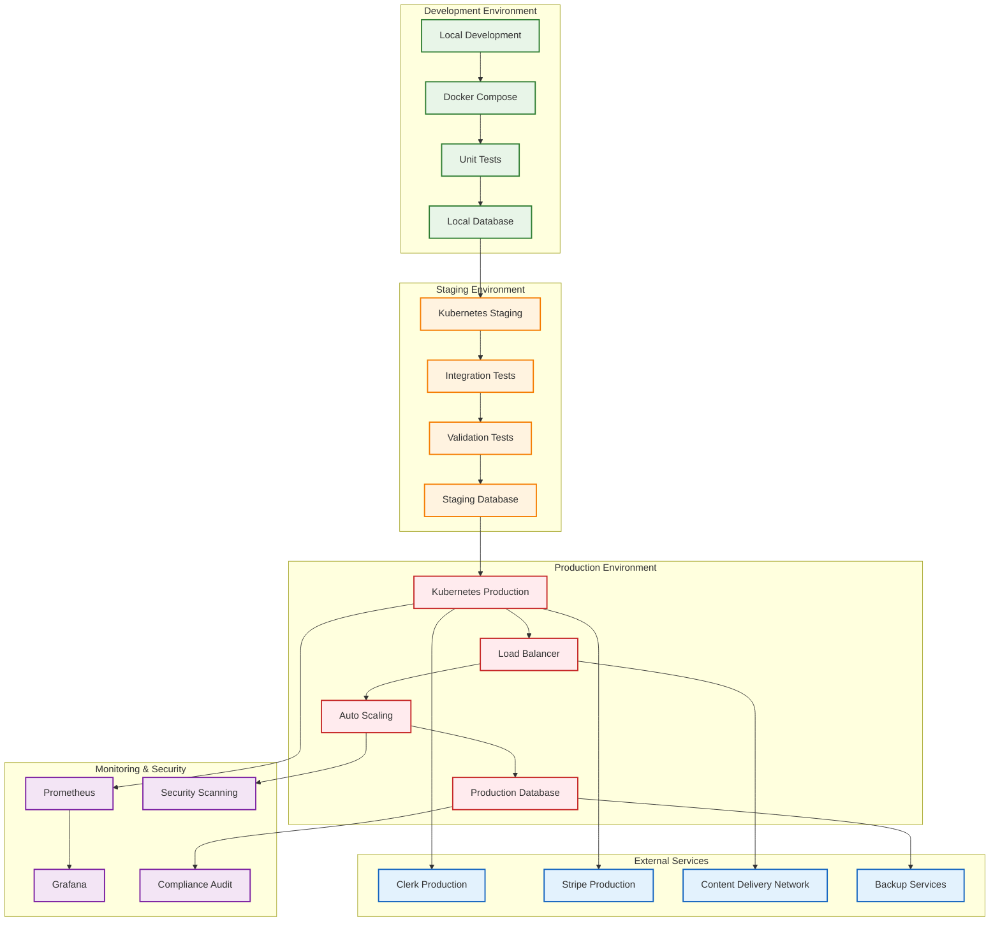

# BiasGuard Backend - Architecture Diagrams

## 🏗️ **BiasGuard Backend Service Architecture**

```mermaid
graph TB
    subgraph "Client Layer"
        WebApp[Web Application]
        MobileApp[Mobile App]
        API[REST API Client]
        SDK[Python/JS SDK]
    end
    
    subgraph "BiasGuard Backend Service (Port 8004)"
        Gateway[API Gateway]
        Router[Request Router]
        BiasDetector[Bias Detector]
        ContentAnalyzer[Content Analyzer]
        MitigationEngine[Mitigation Engine]
        ComplianceChecker[Compliance Checker]
        Monitor[Health Monitor]
    end
    
    subgraph "Bias Detection Algorithms"
        StatisticalBias[Statistical Bias Detection]
        SemanticBias[Semantic Bias Detection]
        DemographicBias[Demographic Bias Detection]
        CulturalBias[Cultural Bias Detection]
        TemporalBias[Temporal Bias Detection]
        ContextualBias[Contextual Bias Detection]
    end
    
    subgraph "Content Analysis Engine"
        TextAnalyzer[Text Analyzer]
        ImageAnalyzer[Image Analyzer]
        AudioAnalyzer[Audio Analyzer]
        VideoAnalyzer[Video Analyzer]
        MetadataAnalyzer[Metadata Analyzer]
    end
    
    subgraph "Mitigation Strategies"
        LanguageMitigation[Language Mitigation]
        ContentMitigation[Content Mitigation]
        AlgorithmMitigation[Algorithm Mitigation]
        TrainingMitigation[Training Mitigation]
    end
    
    subgraph "Compliance Framework"
        EEOCChecker[EEOC Compliance]
        ADAChecker[ADA Compliance]
        GDPRChecker[GDPR Compliance]
        CustomStandards[Custom Standards]
    end
    
    subgraph "Authentication & Payment"
        ClerkAuth[Clerk Authentication]
        StripePayment[Stripe Payment]
        UserManagement[User Management]
        SubscriptionManager[Subscription Manager]
    end
    
    subgraph "Data Layer"
        Database[(PostgreSQL)]
        DrizzleORM[Drizzle ORM]
        Redis[(Redis Cache)]
        FileStorage[(File Storage)]
        VectorDB[(Vector Database)]
    end
    
    subgraph "Monitoring & Observability"
        Prometheus[Prometheus]
        Grafana[Grafana]
        Logs[Audit Logs]
        Alerts[Alert Manager]
    end
    
    %% Client connections
    WebApp --> Gateway
    MobileApp --> Gateway
    API --> Gateway
    SDK --> Gateway
    
    %% Service internal flow
    Gateway --> Router
    Router --> BiasDetector
    Router --> ContentAnalyzer
    Router --> MitigationEngine
    Router --> ComplianceChecker
    
    %% Bias detection
    BiasDetector --> StatisticalBias
    BiasDetector --> SemanticBias
    BiasDetector --> DemographicBias
    BiasDetector --> CulturalBias
    BiasDetector --> TemporalBias
    BiasDetector --> ContextualBias
    
    %% Content analysis
    ContentAnalyzer --> TextAnalyzer
    ContentAnalyzer --> ImageAnalyzer
    ContentAnalyzer --> AudioAnalyzer
    ContentAnalyzer --> VideoAnalyzer
    ContentAnalyzer --> MetadataAnalyzer
    
    %% Mitigation strategies
    MitigationEngine --> LanguageMitigation
    MitigationEngine --> ContentMitigation
    MitigationEngine --> AlgorithmMitigation
    MitigationEngine --> TrainingMitigation
    
    %% Compliance framework
    ComplianceChecker --> EEOCChecker
    ComplianceChecker --> ADAChecker
    ComplianceChecker --> GDPRChecker
    ComplianceChecker --> CustomStandards
    
    %% Authentication and payment
    Gateway --> ClerkAuth
    Gateway --> StripePayment
    ClerkAuth --> UserManagement
    StripePayment --> SubscriptionManager
    
    %% Data connections
    BiasDetector --> Database
    ContentAnalyzer --> DrizzleORM
    MitigationEngine --> Redis
    ComplianceChecker --> FileStorage
    BiasDetector --> VectorDB
    
    %% Monitoring connections
    Gateway --> Prometheus
    Monitor --> Grafana
    Router --> Logs
    BiasDetector --> Alerts
    
    %% Styling
    classDef client fill:#e3f2fd,stroke:#1976d2,stroke-width:2px
    classDef service fill:#f3e5f5,stroke:#7b1fa2,stroke-width:2px
    classDef bias fill:#e8f5e8,stroke:#388e3c,stroke-width:2px
    classDef content fill:#fff3e0,stroke:#f57c00,stroke-width:2px
    classDef mitigation fill:#ffebee,stroke:#c62828,stroke-width:2px
    classDef compliance fill:#f1f8e9,stroke:#689f38,stroke-width:2px
    classDef auth fill:#e0f2f1,stroke:#00695c,stroke-width:2px
    classDef data fill:#fce4ec,stroke:#ad1457,stroke-width:2px
    classDef monitoring fill:#f3e5f5,stroke:#7b1fa2,stroke-width:2px
    
    class WebApp,MobileApp,API,SDK client
    class Gateway,Router,BiasDetector,ContentAnalyzer,MitigationEngine,ComplianceChecker,Monitor service
    class StatisticalBias,SemanticBias,DemographicBias,CulturalBias,TemporalBias,ContextualBias bias
    class TextAnalyzer,ImageAnalyzer,AudioAnalyzer,VideoAnalyzer,MetadataAnalyzer content
    class LanguageMitigation,ContentMitigation,AlgorithmMitigation,TrainingMitigation mitigation
    class EEOCChecker,ADAChecker,GDPRChecker,CustomStandards compliance
    class ClerkAuth,StripePayment,UserManagement,SubscriptionManager auth
    class Database,DrizzleORM,Redis,FileStorage,VectorDB data
    class Prometheus,Grafana,Logs,Alerts monitoring
```

## 🔍 **Bias Detection Flow**

## 🧠 **Bias Detection Algorithm Architecture**

## 🛡️ **Mitigation Strategy Engine**

```mermaid
graph TB
    subgraph "Bias Input"
        DetectedBias[Detected Bias]
        BiasCategory[Bias Category]
        SeverityLevel[Severity Level]
        Context[Context Information]
    end
    
    subgraph "Mitigation Strategies"
        LanguageStrategy[Language Mitigation]
        ContentStrategy[Content Mitigation]
        AlgorithmStrategy[Algorithm Mitigation]
        TrainingStrategy[Training Mitigation]
    end
    
    subgraph "Language Mitigation"
        NeutralLanguage[Neutral Language]
        InclusiveTerms[Inclusive Terms]
        BiasFreePhrases[Bias-free Phrases]
        CulturalSensitivity[Cultural Sensitivity]
    end
    
    subgraph "Content Mitigation"
        DiverseExamples[Diverse Examples]
        BalancedRepresentation[Balanced Representation]
        InclusiveImagery[Inclusive Imagery]
        FairContent[Fair Content]
    end
    
    subgraph "Algorithm Mitigation"
        FairnessConstraints[Fairness Constraints]
        BiasCorrection[Bias Correction]
        EqualizedOdds[Equalized Odds]
        DemographicParity[Demographic Parity]
    end
    
    subgraph "Training Mitigation"
        BiasAwareTraining[Bias-aware Training]
        DiverseTraining[Diverse Training Data]
        FairnessMetrics[Fairness Metrics]
        ContinuousLearning[Continuous Learning]
    end
    
    DetectedBias --> LanguageStrategy
    BiasCategory --> ContentStrategy
    SeverityLevel --> AlgorithmStrategy
    Context --> TrainingStrategy
    
    LanguageStrategy --> NeutralLanguage
    LanguageStrategy --> InclusiveTerms
    LanguageStrategy --> BiasFreePhrases
    LanguageStrategy --> CulturalSensitivity
    
    ContentStrategy --> DiverseExamples
    ContentStrategy --> BalancedRepresentation
    ContentStrategy --> InclusiveImagery
    ContentStrategy --> FairContent
    
    AlgorithmStrategy --> FairnessConstraints
    AlgorithmStrategy --> BiasCorrection
    AlgorithmStrategy --> EqualizedOdds
    AlgorithmStrategy --> DemographicParity
    
    TrainingStrategy --> BiasAwareTraining
    TrainingStrategy --> DiverseTraining
    TrainingStrategy --> FairnessMetrics
    TrainingStrategy --> ContinuousLearning
    
    classDef input fill:#e3f2fd,stroke:#1976d2,stroke-width:2px
    classDef strategies fill:#f3e5f5,stroke:#7b1fa2,stroke-width:2px
    classDef language fill:#e8f5e8,stroke:#388e3c,stroke-width:2px
    classDef content fill:#fff3e0,stroke:#f57c00,stroke-width:2px
    classDef algorithm fill:#ffebee,stroke:#c62828,stroke-width:2px
    classDef training fill:#f1f8e9,stroke:#689f38,stroke-width:2px
    
    class DetectedBias,BiasCategory,SeverityLevel,Context input
    class LanguageStrategy,ContentStrategy,AlgorithmStrategy,TrainingStrategy strategies
    class NeutralLanguage,InclusiveTerms,BiasFreePhrases,CulturalSensitivity language
    class DiverseExamples,BalancedRepresentation,InclusiveImagery,FairContent content
    class FairnessConstraints,BiasCorrection,EqualizedOdds,DemographicParity algorithm
    class BiasAwareTraining,DiverseTraining,FairnessMetrics,ContinuousLearning training
```

## 📋 **Compliance Framework Architecture**

## 💳 **Authentication & Payment Integration**

## 📊 **Bias Detection Performance Metrics**

## 🔧 **Deployment Architecture**

