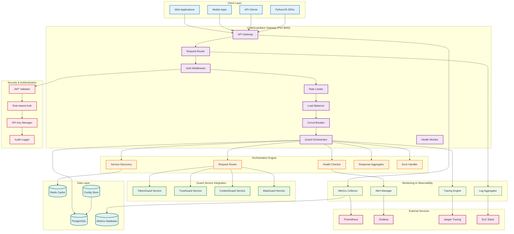
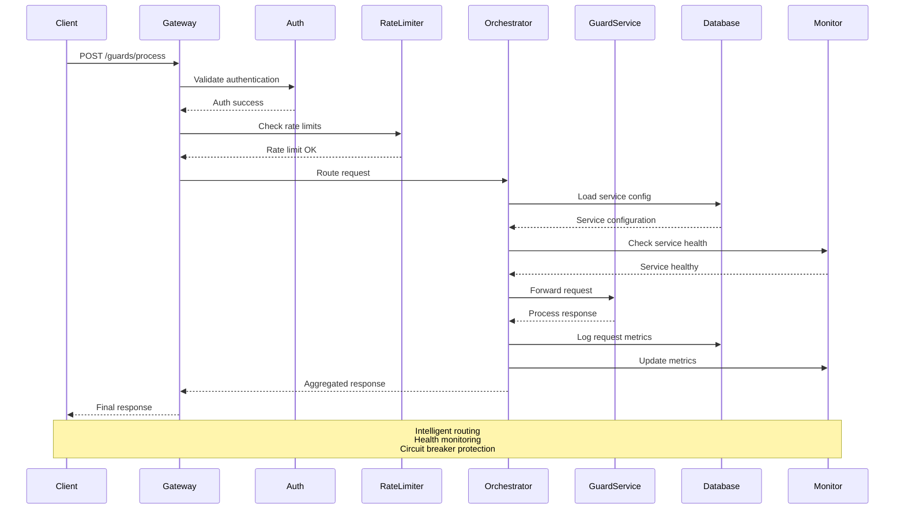
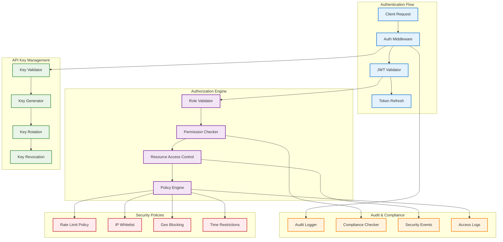
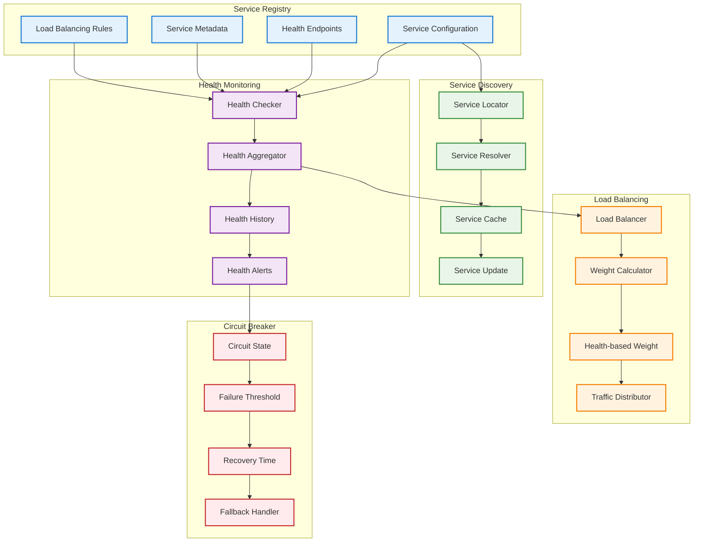
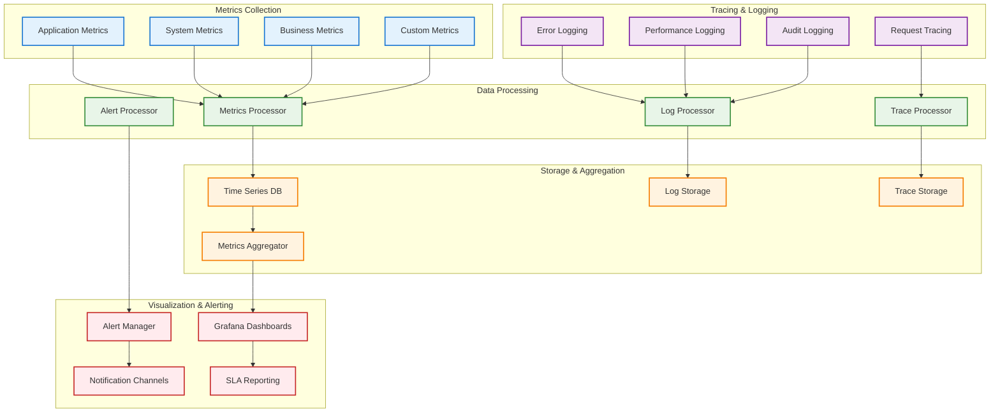
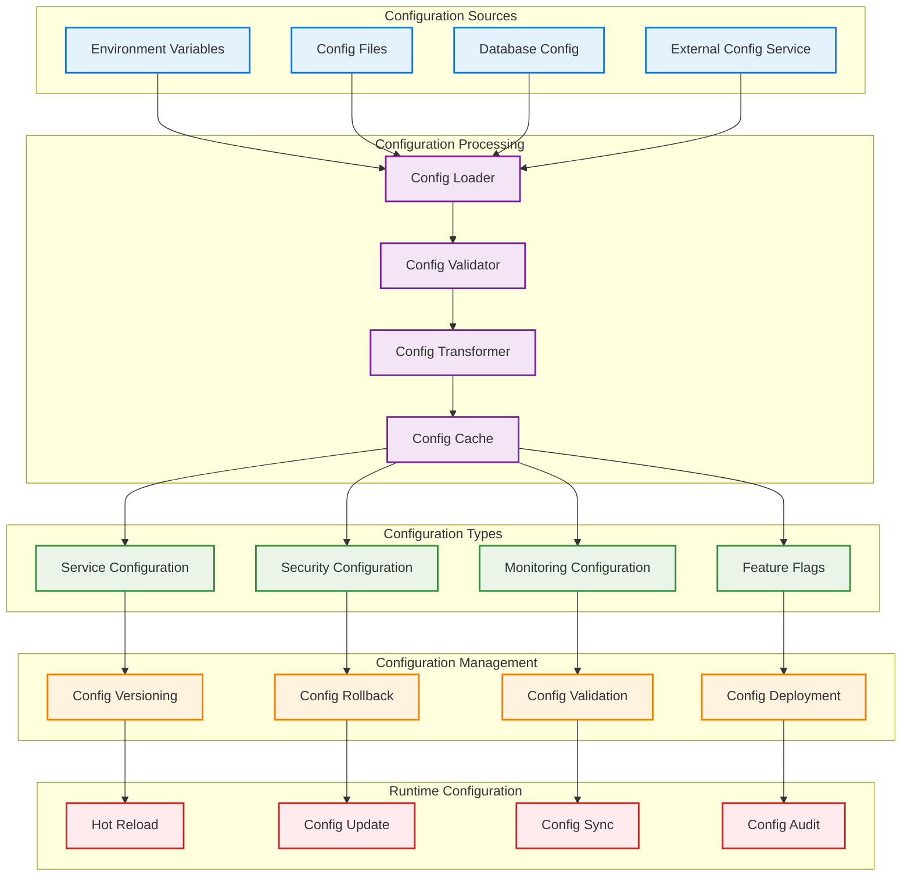
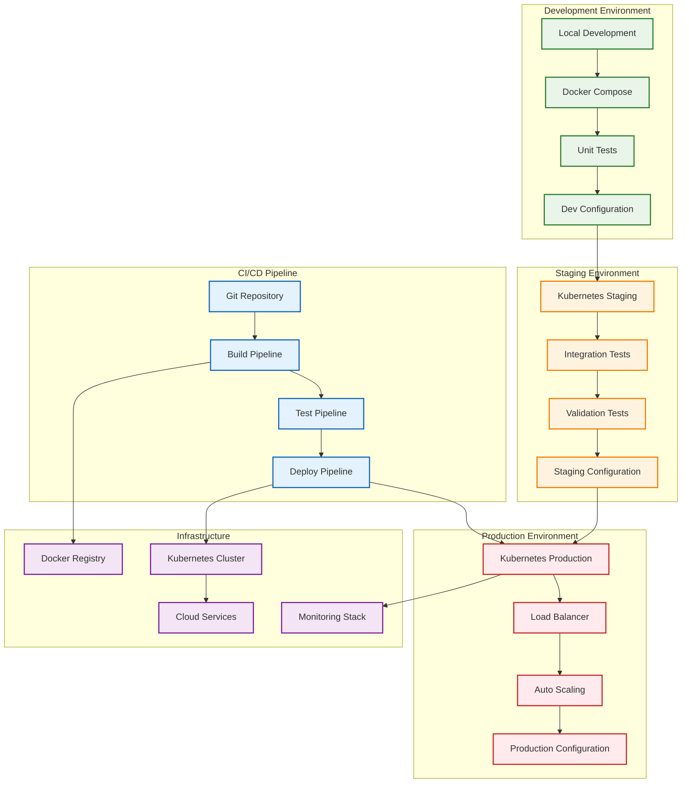
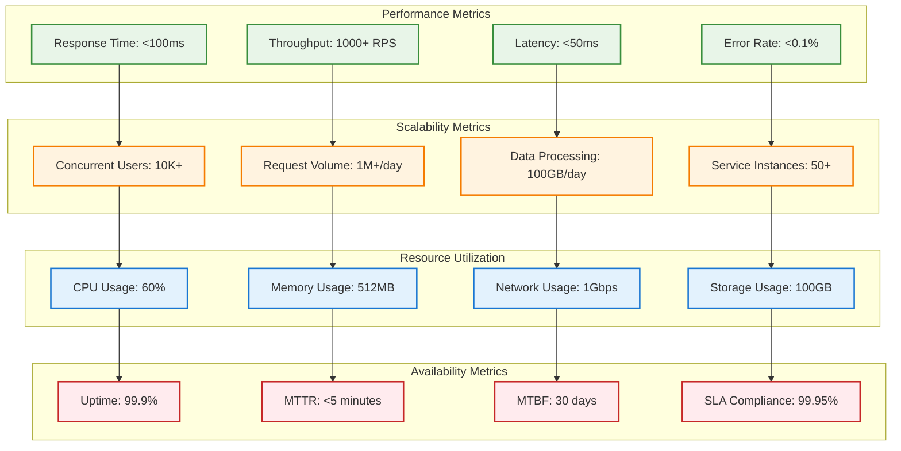

# CodeGuardians Gateway - Architecture Diagrams

## 🏗️ **CodeGuardians Gateway Service Architecture**

## 🔄 **Request Orchestration Flow**

## 🛡️ **Security & Authentication Architecture**

## 🔍 **Service Discovery & Health Monitoring**

## 📊 **Monitoring & Observability Architecture**

## 🔧 **Configuration Management Architecture**

## 🚀 **Deployment Architecture**

## 📈 **Performance & Scalability Metrics**

