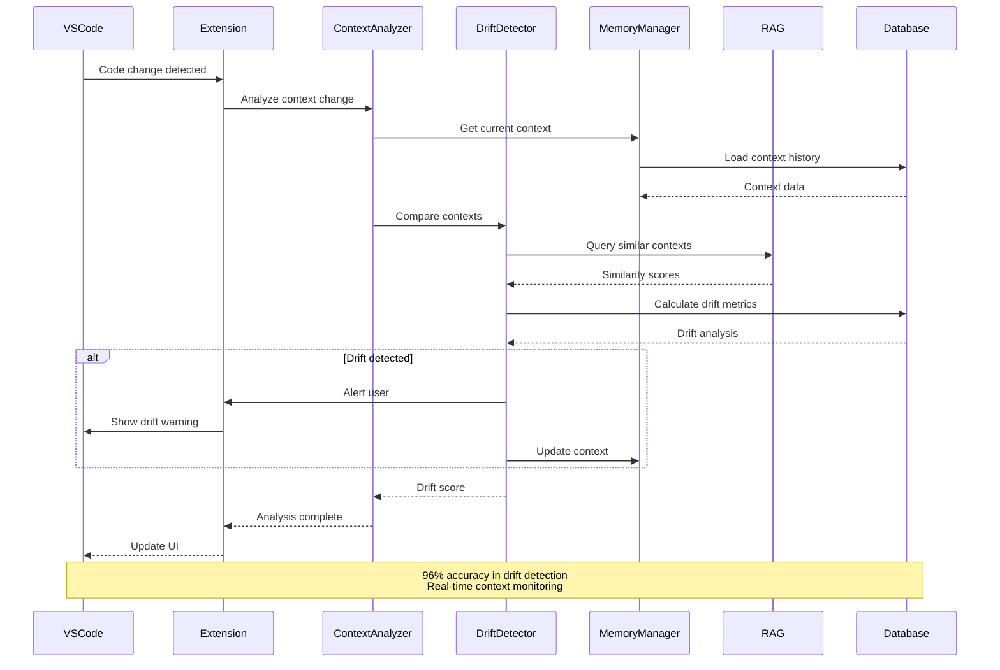
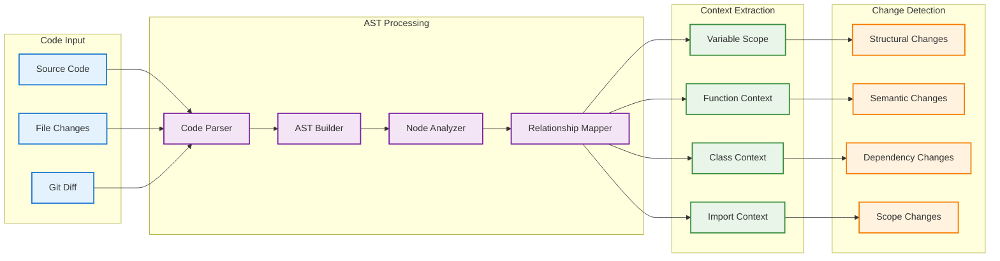
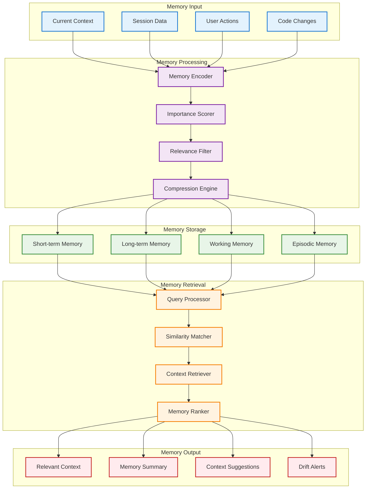
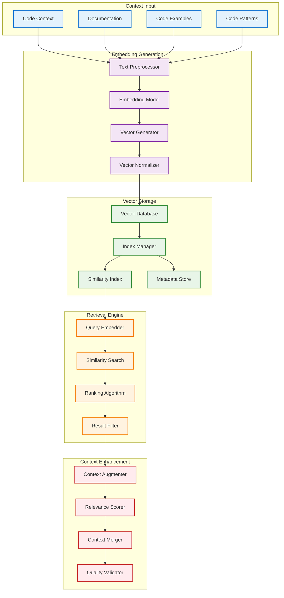
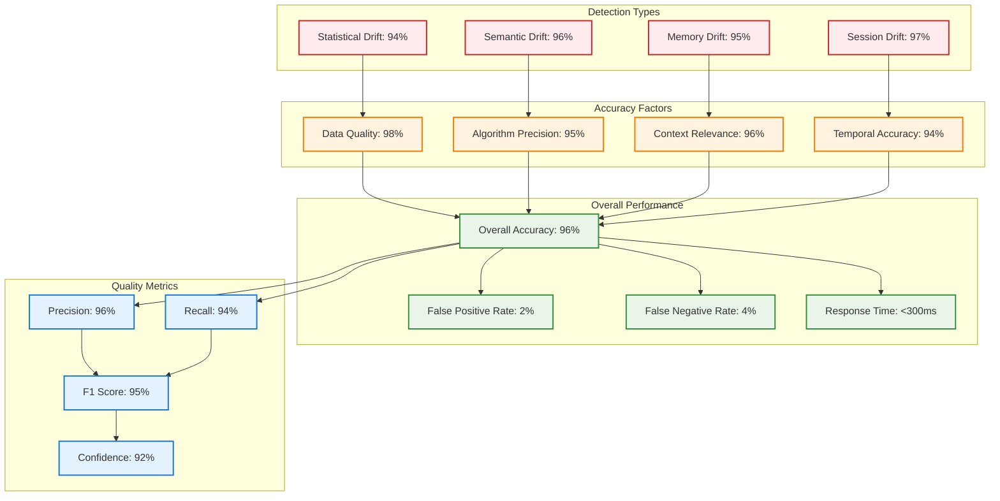
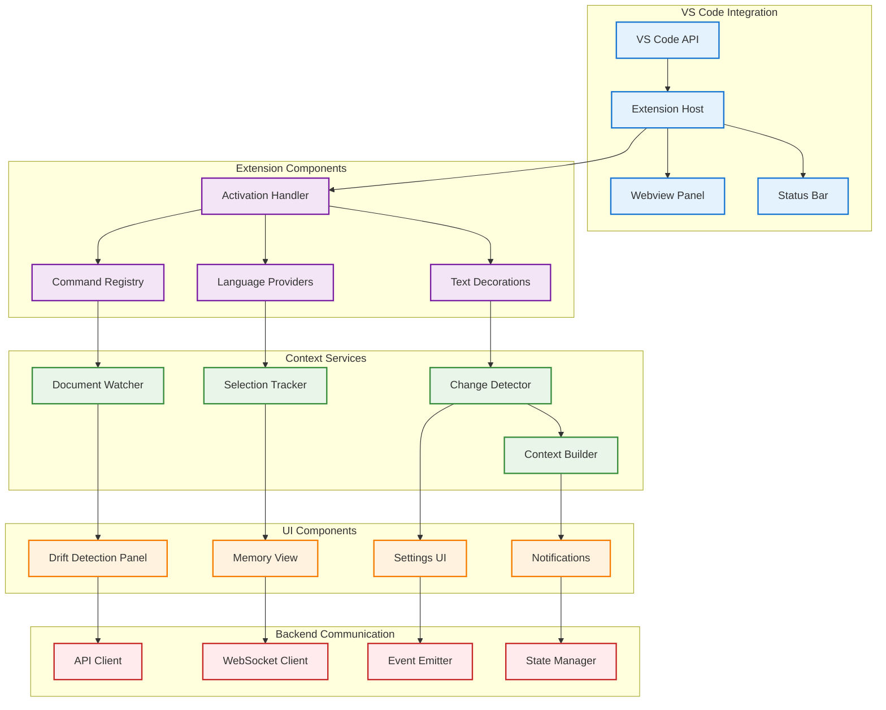

# ContextGuard - Architecture Diagrams

## 🏗️ **ContextGuard Service Architecture**

```mermaid
graph TB
    subgraph "VS Code Extension Layer"
        VSCode[VS Code IDE]
        Extension[ContextGuard Extension]
        UI[Extension UI]
        Commands[Extension Commands]
    end
    
    subgraph "ContextGuard Service (Port 8003)"
        Gateway[API Gateway]
        Router[Request Router]
        ContextAnalyzer[Context Analyzer]
        DriftDetector[Drift Detector]
        MemoryManager[Memory Manager]
        SessionTracker[Session Tracker]
        Monitor[Health Monitor]
    end
    
    subgraph "Context Analysis Engine"
        ASTAnalyzer[AST Analyzer]
        SemanticAnalyzer[Semantic Analyzer]
        PatternAnalyzer[Pattern Analyzer]
        SimilarityEngine[Similarity Engine]
    end
    
    subgraph "Drift Detection Algorithms"
        StatisticalDrift[Statistical Drift Detection]
        SemanticDrift[Semantic Drift Detection]
        MemoryDrift[Memory Drift Detection]
        SessionDrift[Session Drift Detection]
    end
    
    subgraph "Memory Management"
        MemoryBank[Memory Bank]
        ContextCache[Context Cache]
        SessionStore[Session Store]
        HistoryTracker[History Tracker]
    end
    
    subgraph "RAG Integration"
        VectorStore[Vector Store]
        EmbeddingEngine[Embedding Engine]
        RetrievalEngine[Retrieval Engine]
        RankingEngine[Ranking Engine]
    end
    
    subgraph "Data Layer"
        Database[(PostgreSQL)]
        Redis[(Redis Cache)]
        Files[(File Storage)]
        Metrics[(Metrics Store)]
    end
    
    subgraph "Monitoring & Observability"
        Prometheus[Prometheus]
        Grafana[Grafana]
        Logs[Structured Logs]
        Alerts[Alert Manager]
    end
    
    %% VS Code connections
    VSCode --> Extension
    Extension --> UI
    Extension --> Commands
    Extension --> Gateway
    
    %% Service internal flow
    Gateway --> Router
    Router --> ContextAnalyzer
    ContextAnalyzer --> DriftDetector
    ContextAnalyzer --> MemoryManager
    ContextAnalyzer --> SessionTracker
    
    %% Context analysis
    ContextAnalyzer --> ASTAnalyzer
    ContextAnalyzer --> SemanticAnalyzer
    ContextAnalyzer --> PatternAnalyzer
    ContextAnalyzer --> SimilarityEngine
    
    %% Drift detection
    DriftDetector --> StatisticalDrift
    DriftDetector --> SemanticDrift
    DriftDetector --> MemoryDrift
    DriftDetector --> SessionDrift
    
    %% Memory management
    MemoryManager --> MemoryBank
    MemoryManager --> ContextCache
    MemoryManager --> SessionStore
    MemoryManager --> HistoryTracker
    
    %% RAG integration
    ContextAnalyzer --> VectorStore
    VectorStore --> EmbeddingEngine
    VectorStore --> RetrievalEngine
    VectorStore --> RankingEngine
    
    %% Data connections
    ContextAnalyzer --> Database
    MemoryManager --> Redis
    SessionTracker --> Files
    DriftDetector --> Metrics
    
    %% Monitoring connections
    Gateway --> Prometheus
    Monitor --> Grafana
    Router --> Logs
    DriftDetector --> Alerts
    
    %% Styling
    classDef vscode fill:#e3f2fd,stroke:#1976d2,stroke-width:2px
    classDef service fill:#f3e5f5,stroke:#7b1fa2,stroke-width:2px
    classDef analysis fill:#e8f5e8,stroke:#388e3c,stroke-width:2px
    classDef drift fill:#fff3e0,stroke:#f57c00,stroke-width:2px
    classDef memory fill:#ffebee,stroke:#c62828,stroke-width:2px
    classDef rag fill:#f1f8e9,stroke:#689f38,stroke-width:2px
    classDef data fill:#e0f2f1,stroke:#00695c,stroke-width:2px
    classDef monitoring fill:#fce4ec,stroke:#ad1457,stroke-width:2px
    
    class VSCode,Extension,UI,Commands vscode
    class Gateway,Router,ContextAnalyzer,DriftDetector,MemoryManager,SessionTracker,Monitor service
    class ASTAnalyzer,SemanticAnalyzer,PatternAnalyzer,SimilarityEngine analysis
    class StatisticalDrift,SemanticDrift,MemoryDrift,SessionDrift drift
    class MemoryBank,ContextCache,SessionStore,HistoryTracker memory
    class VectorStore,EmbeddingEngine,RetrievalEngine,RankingEngine rag
    class Database,Redis,Files,Metrics data
    class Prometheus,Grafana,Logs,Alerts monitoring
```

## 🔍 **Context Drift Detection Flow**

## 🧠 **AST-Based Analysis Engine**

## 🧠 **Memory Management Architecture**

## 🔗 **RAG Integration Architecture**

## 📊 **Drift Detection Accuracy Metrics**

## 🔧 **VS Code Extension Architecture**

