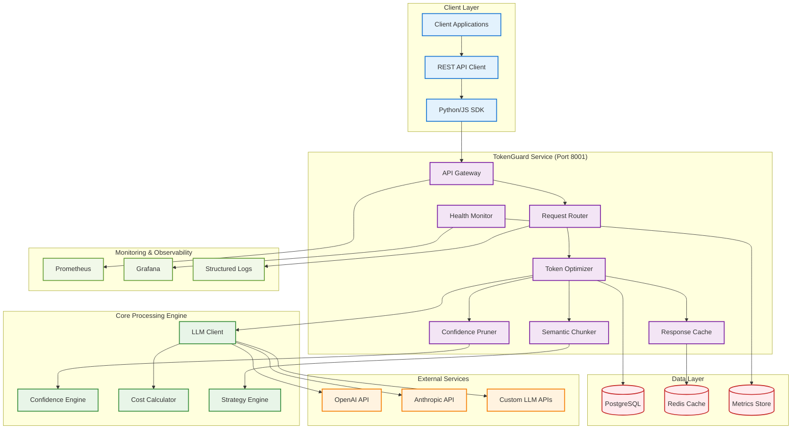
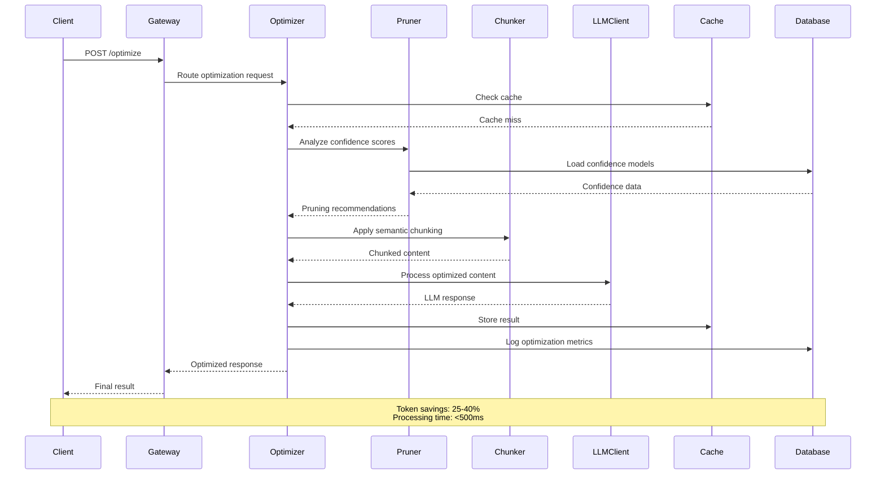
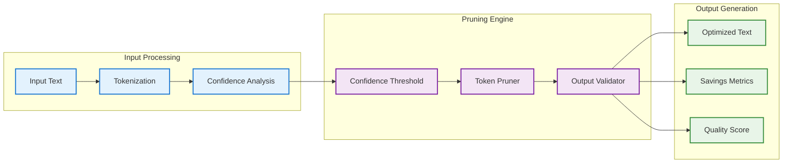
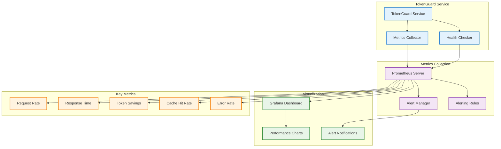
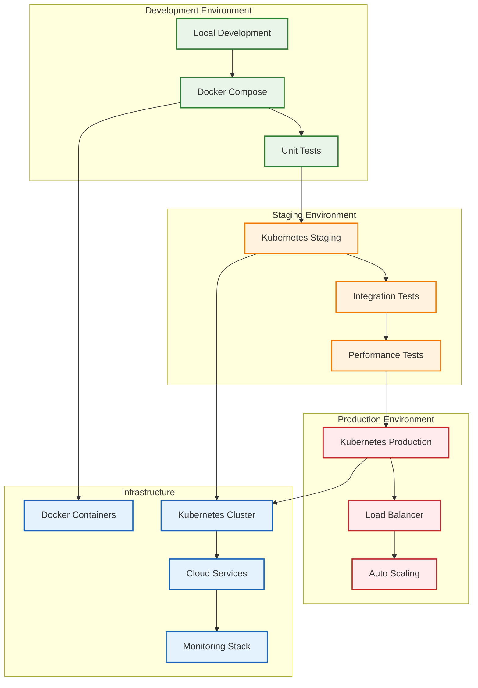

# TokenGuard - Architecture Diagrams

## 🏗️ **TokenGuard Service Architecture**

## 🔄 **Token Optimization Flow**

## 🧠 **Confidence-Based Pruning Algorithm**

## 📊 **Performance Monitoring Architecture**

## 🔧 **Deployment Architecture**

