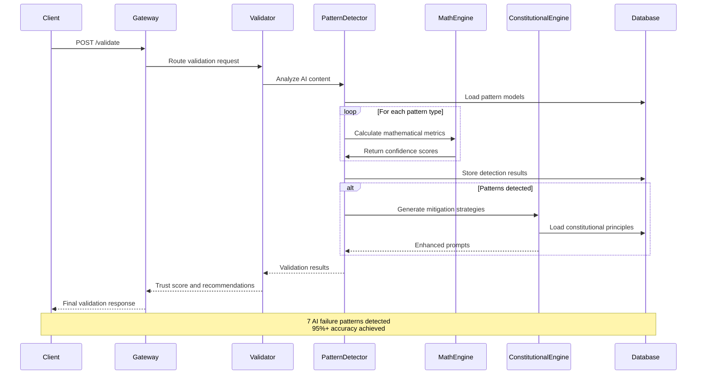
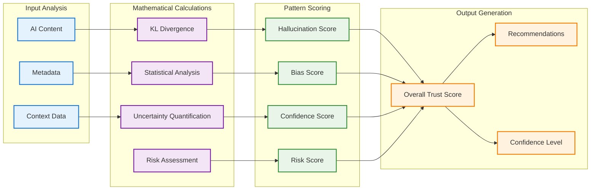
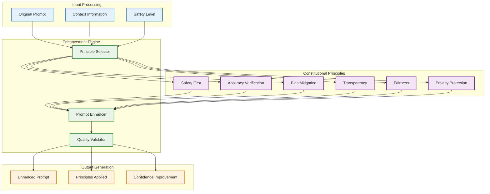
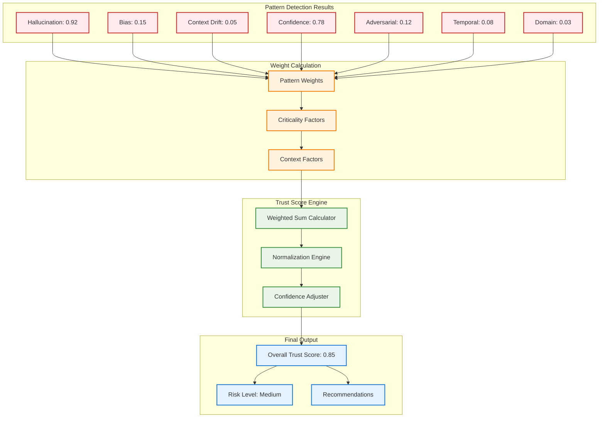
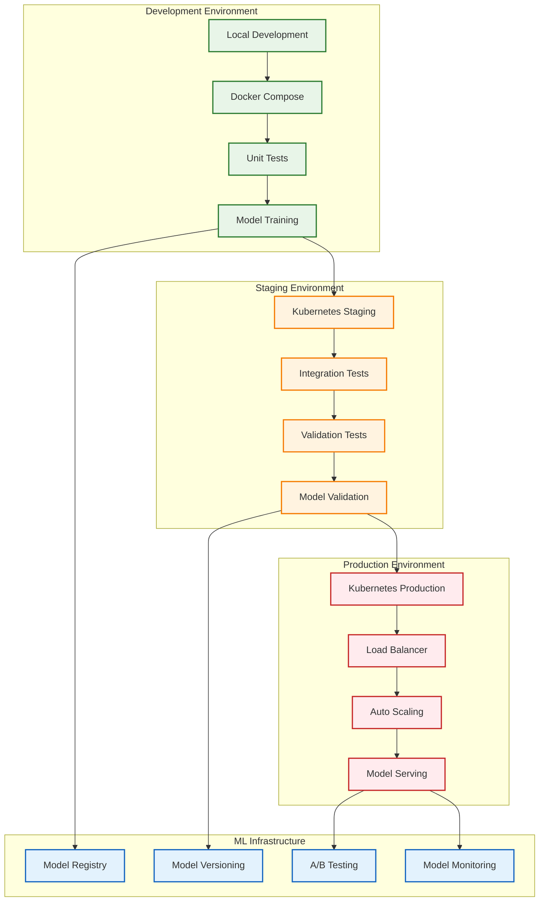

# TrustGuard - Architecture Diagrams

## 🏗️ **TrustGuard Service Architecture**

```mermaid
graph TB
    subgraph "Client Layer"
        Client[Client Applications]
        API[REST API Client]
        SDK[Python/JS SDK]
    end
    
    subgraph "TrustGuard Service (Port 8002)"
        Gateway[API Gateway]
        Router[Request Router]
        Validator[AI Validator]
        PatternDetector[Pattern Detector]
        ConstitutionalEngine[Constitutional Engine]
        Monitor[Health Monitor]
    end
    
    subgraph "AI Failure Pattern Detection"
        HallucinationDetector[Hallucination Detector]
        BiasDetector[Bias Amplification Detector]
        ContextDriftDetector[Context Drift Detector]
        ConfidenceDetector[Confidence Miscalibration Detector]
        AdversarialDetector[Adversarial Vulnerability Detector]
        TemporalDetector[Temporal Inconsistency Detector]
        DomainDetector[Domain Boundary Detector]
    end
    
    subgraph "Mathematical Validation Engine"
        KLDivergence[KL Divergence Calculator]
        UncertaintyQuant[Uncertainty Quantification]
        StatisticalAnalysis[Statistical Analysis]
        RiskAssessment[Risk Assessment]
    end
    
    subgraph "Constitutional Prompting"
        SafetyPrinciples[Safety Principles]
        AccuracyVerification[Accuracy Verification]
        BiasMitigation[Bias Mitigation]
        Transparency[Transparency Rules]
    end
    
    subgraph "Data Layer"
        Database[(PostgreSQL)]
        VectorDB[(Vector Database)]
        Models[(ML Models)]
        Cache[(Redis Cache)]
    end
    
    subgraph "Monitoring & Observability"
        Prometheus[Prometheus]
        Grafana[Grafana]
        Logs[Audit Logs]
        Alerts[Alert Manager]
    end
    
    %% Client connections
    Client --> API
    API --> SDK
    SDK --> Gateway
    
    %% Service internal flow
    Gateway --> Router
    Router --> Validator
    Validator --> PatternDetector
    Validator --> ConstitutionalEngine
    
    %% Pattern detection
    PatternDetector --> HallucinationDetector
    PatternDetector --> BiasDetector
    PatternDetector --> ContextDriftDetector
    PatternDetector --> ConfidenceDetector
    PatternDetector --> AdversarialDetector
    PatternDetector --> TemporalDetector
    PatternDetector --> DomainDetector
    
    %% Mathematical validation
    PatternDetector --> KLDivergence
    PatternDetector --> UncertaintyQuant
    PatternDetector --> StatisticalAnalysis
    PatternDetector --> RiskAssessment
    
    %% Constitutional prompting
    ConstitutionalEngine --> SafetyPrinciples
    ConstitutionalEngine --> AccuracyVerification
    ConstitutionalEngine --> BiasMitigation
    ConstitutionalEngine --> Transparency
    
    %% Data connections
    Validator --> Database
    PatternDetector --> VectorDB
    PatternDetector --> Models
    ConstitutionalEngine --> Cache
    
    %% Monitoring connections
    Gateway --> Prometheus
    Monitor --> Grafana
    Router --> Logs
    PatternDetector --> Alerts
    
    %% Styling
    classDef client fill:#e3f2fd,stroke:#1976d2,stroke-width:2px
    classDef service fill:#f3e5f5,stroke:#7b1fa2,stroke-width:2px
    classDef patterns fill:#e8f5e8,stroke:#388e3c,stroke-width:2px
    classDef math fill:#fff3e0,stroke:#f57c00,stroke-width:2px
    classDef constitutional fill:#ffebee,stroke:#c62828,stroke-width:2px
    classDef data fill:#f1f8e9,stroke:#689f38,stroke-width:2px
    classDef monitoring fill:#e0f2f1,stroke:#00695c,stroke-width:2px
    
    class Client,API,SDK client
    class Gateway,Router,Validator,PatternDetector,ConstitutionalEngine,Monitor service
    class HallucinationDetector,BiasDetector,ContextDriftDetector,ConfidenceDetector,AdversarialDetector,TemporalDetector,DomainDetector patterns
    class KLDivergence,UncertaintyQuant,StatisticalAnalysis,RiskAssessment math
    class SafetyPrinciples,AccuracyVerification,BiasMitigation,Transparency constitutional
    class Database,VectorDB,Models,Cache data
    class Prometheus,Grafana,Logs,Alerts monitoring
```

## 🔍 **AI Failure Pattern Detection Flow**

## 🧮 **Mathematical Validation Engine**

## 🛡️ **Constitutional Prompting Architecture**

## 📊 **Trust Score Calculation**

## 🔧 **Deployment Architecture**

